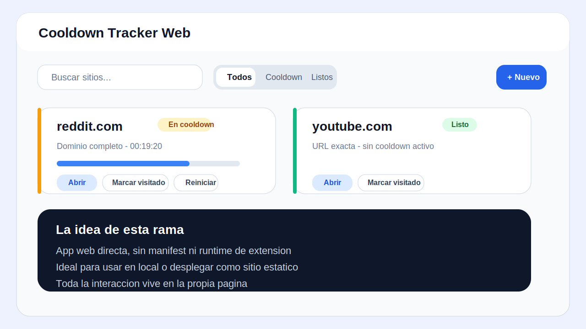
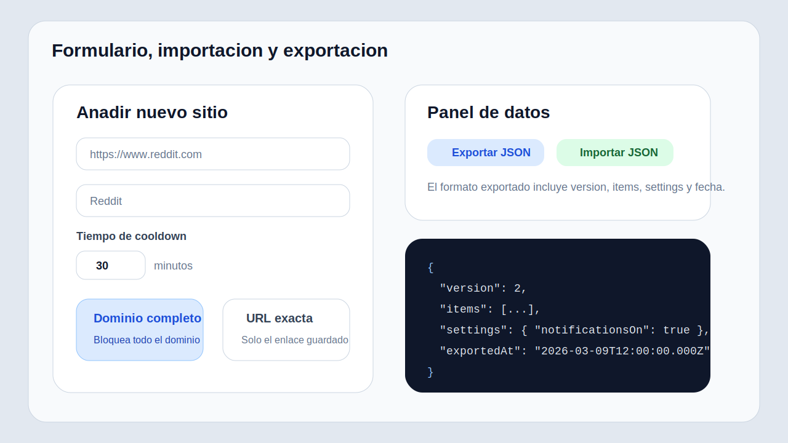

# Cooldown Tracker Web

Version web de Cooldown Tracker. Esta rama esta pensada para ejecutarse como aplicacion web con Vite y React, sin dependencias de extension de navegador.

## Que hace

- Guarda sitios con cooldown personalizado
- Permite definir el bloqueo por dominio o por URL exacta
- Inicia el cooldown al marcar una visita o abrir el sitio desde la app
- Muestra el progreso del cooldown en tiempo real
- Notifica cuando un sitio vuelve a estar disponible
- Exporta e importa datos en JSON versionado

## Capturas

### Vista principal



### Flujo de formulario e importacion



## Requisitos

- Node.js 18+
- npm

## Instalacion

```bash
npm install
```

## Desarrollo local

```bash
npm run dev
```

Vite levantara una URL local, normalmente `http://localhost:5173`.

## Build de produccion

```bash
npm run build
npm run preview
```

La salida de produccion se genera en `dist`.

Archivos clave:

- [src/App.jsx](c:/Users/Marcos/Documents/Proyectos/cooldown-tracker/src/App.jsx)
- [src/components](c:/Users/Marcos/Documents/Proyectos/cooldown-tracker/src/components)
- [src/hooks](c:/Users/Marcos/Documents/Proyectos/cooldown-tracker/src/hooks)
- [src/lib](c:/Users/Marcos/Documents/Proyectos/cooldown-tracker/src/lib)

## Calidad

```bash
npm run lint
npm run test:run
```

## Ejemplos de uso

### Ejemplo 1: limitar una red social por dominio

Configura:

- URL: `https://www.reddit.com`
- Ambito: `Dominio completo`
- Cooldown: `30 minutos`

Resultado:

- Cuando la abras desde la app o la marques como visitada, el cooldown se aplica al dominio completo.

### Ejemplo 2: limitar una URL concreta

Configura:

- URL: `https://www.youtube.com/shorts/abc123`
- Ambito: `URL exacta`
- Cooldown: `10 minutos`

Resultado:

- El cooldown afecta solo a esa URL guardada, no al resto del dominio.

### Ejemplo 3: exportar tus datos

Formato de salida esperado:

```json
{
  "version": 2,
  "items": [
    {
      "id": "site-1",
      "url": "https://example.com/",
      "label": "Example",
      "scope": "domain",
      "durationMs": 1800000,
      "endAt": null,
      "lastVisitedAt": null,
      "createdAt": 1741516800000,
      "updatedAt": 1741516800000,
      "favicon": "https://www.google.com/s2/favicons?domain=example.com&sz=64"
    }
  ],
  "settings": {
    "defaultDurationMs": 1800000,
    "notificationsOn": true,
    "soundOn": true
  },
  "exportedAt": "2026-03-09T12:00:00.000Z"
}
```

## Flujo recomendado

1. Arranca la app con `npm run dev`
2. Anade tus sitios mas frecuentes
3. Define si el cooldown debe aplicarse por dominio o por URL exacta
4. Marca cada visita para iniciar la cuenta atras
5. Usa filtros para ver activos, listos o buscar rapido
6. Exporta tus datos antes de cambios grandes

## Estructura del proyecto

- [src/App.jsx](c:/Users/Marcos/Documents/Proyectos/cooldown-tracker/src/App.jsx): contenedor principal
- [src/components/SiteCard.jsx](c:/Users/Marcos/Documents/Proyectos/cooldown-tracker/src/components/SiteCard.jsx): tarjeta de sitio y acciones
- [src/components/AddEditModal.jsx](c:/Users/Marcos/Documents/Proyectos/cooldown-tracker/src/components/AddEditModal.jsx): alta y edicion
- [src/components/SettingsPanel.jsx](c:/Users/Marcos/Documents/Proyectos/cooldown-tracker/src/components/SettingsPanel.jsx): ajustes, importacion y exportacion
- [src/hooks/useNotificationCenter.js](c:/Users/Marcos/Documents/Proyectos/cooldown-tracker/src/hooks/useNotificationCenter.js): notificaciones y sonido
- [src/lib/sites.js](c:/Users/Marcos/Documents/Proyectos/cooldown-tracker/src/lib/sites.js): logica de dominio, cooldowns y parsing
- [src/lib/storage.js](c:/Users/Marcos/Documents/Proyectos/cooldown-tracker/src/lib/storage.js): persistencia en `localStorage`

## Problemas comunes

### La app abre pero no guarda nada

Comprueba que `localStorage` no este bloqueado en tu navegador y que no estes en un contexto privado que lo limpie automaticamente.

### Las notificaciones no aparecen

Comprueba:

- permiso de notificaciones del navegador
- que la opcion `Notificaciones` este activada
- que la pestana siga abierta

Sin Web Push ni backend, las notificaciones no sobreviven a una pestana totalmente cerrada.

### El boton de abrir no hace nada

Suele ser un bloqueo de popups del navegador. Permite popups para la app o prueba en otra pestana normal.

## Notas tecnicas

- La app usa React 18 y Vite.
- El estilo usa Tailwind integrado mediante PostCSS.
- Los datos exportados incluyen `version`, `items`, `settings` y `exportedAt`.
- Hay tests sobre la logica pura en [src/lib/sites.test.js](c:/Users/Marcos/Documents/Proyectos/cooldown-tracker/src/lib/sites.test.js).
