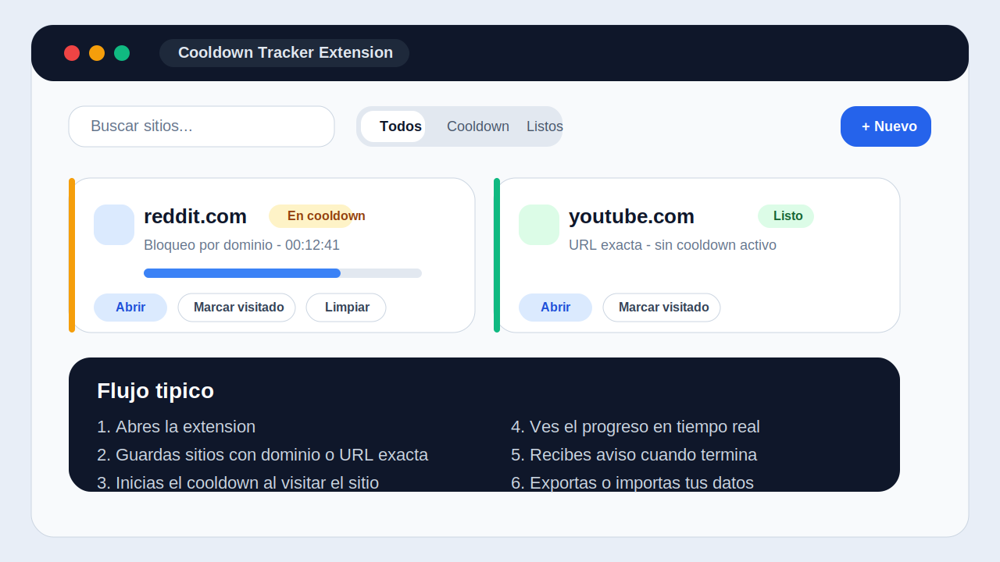
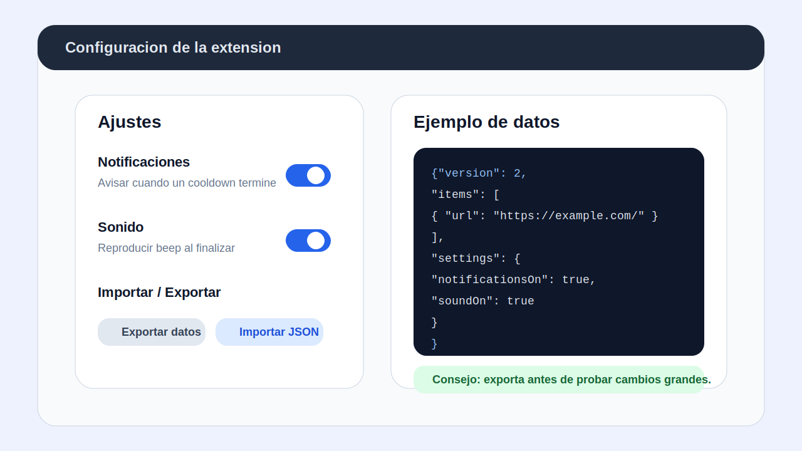

# Cooldown Tracker Extension

Rama orientada a extension de navegador para Chrome/Edge. Al pulsar el icono de la extension, se abre la app en una pestana propia de extension para gestionar cooldowns entre visitas.

## Que hace

- Guarda sitios con cooldown personalizado
- Permite bloquear por dominio completo o por URL exacta
- Marca una visita para arrancar la cuenta atras
- Reabre el sitio y reinicia el cooldown desde la propia UI
- Exporta e importa datos en JSON versionado
- Muestra avisos in-app y notificaciones del navegador cuando un cooldown termina

## Capturas

### Vista principal



### Ajustes e import/export



## Requisitos

- Node.js 18+
- npm
- Chrome o Edge

## Instalacion

```bash
npm install
```

## Desarrollo local

Si quieres trabajarla como app web mientras desarrollas:

```bash
npm run dev
```

Vite levantara una URL local, normalmente `http://localhost:5173`.

## Compilar la extension

```bash
npm run build
```

La carpeta que debes cargar en el navegador es `dist`.

Archivos clave esperados tras la build:

- [dist/index.html](c:/Users/Marcos/Documents/Proyectos/cooldown-tracker/dist/index.html)
- [dist/manifest.json](c:/Users/Marcos/Documents/Proyectos/cooldown-tracker/dist/manifest.json)
- [dist/background.js](c:/Users/Marcos/Documents/Proyectos/cooldown-tracker/dist/background.js)

## Cargarla en Chrome o Edge

1. Ejecuta `npm run build`
2. Abre `chrome://extensions` o `edge://extensions`
3. Activa `Developer mode`
4. Pulsa `Load unpacked` / `Cargar descomprimida`
5. Selecciona la carpeta `dist`
6. Pulsa el icono de la extension

Importante:

- No cargues `public`
- No cargues `src`
- No cargues la carpeta `extension`
- No cargues la raiz del proyecto

La extension no usa popup efimero. El icono abre una pestana propia de extension para que la app siga viva mientras la tengas abierta.

## Comandos utiles

```bash
npm run dev
npm run build
npm run preview
npm run lint
npm run test:run
```

## Ejemplos de uso

### Ejemplo 1: bloquear una red social por dominio

Configura:

- URL: `https://www.reddit.com`
- Ambito: `Dominio completo`
- Cooldown: `30 minutos`

Resultado:

- Si marcas una visita o abres Reddit desde la app, cualquier nueva visita al dominio quedara asociada a ese cooldown.

### Ejemplo 2: bloquear solo una pagina concreta

Configura:

- URL: `https://www.youtube.com/shorts/abc123`
- Ambito: `URL exacta`
- Cooldown: `10 minutos`

Resultado:

- El cooldown se aplica a esa URL guardada, no a todo YouTube.

### Ejemplo 3: exportar e importar datos

Exportacion generada por la app:

```json
{
  "version": 2,
  "items": [
    {
      "id": "site-1",
      "url": "https://example.com/",
      "label": "Example",
      "scope": "domain",
      "durationMs": 1800000,
      "endAt": null,
      "lastVisitedAt": null,
      "createdAt": 1741516800000,
      "updatedAt": 1741516800000,
      "favicon": "https://www.google.com/s2/favicons?domain=example.com&sz=64"
    }
  ],
  "settings": {
    "defaultDurationMs": 1800000,
    "notificationsOn": true,
    "soundOn": true
  },
  "exportedAt": "2026-03-09T12:00:00.000Z"
}
```

## Estructura relevante

- [public/manifest.json](c:/Users/Marcos/Documents/Proyectos/cooldown-tracker/public/manifest.json): manifiesto MV3
- [public/background.js](c:/Users/Marcos/Documents/Proyectos/cooldown-tracker/public/background.js): abre o enfoca la pestana de la extension
- [src/App.jsx](c:/Users/Marcos/Documents/Proyectos/cooldown-tracker/src/App.jsx): contenedor principal
- [src/components](c:/Users/Marcos/Documents/Proyectos/cooldown-tracker/src/components): UI modularizada
- [src/hooks](c:/Users/Marcos/Documents/Proyectos/cooldown-tracker/src/hooks): notificaciones y toasts
- [src/lib](c:/Users/Marcos/Documents/Proyectos/cooldown-tracker/src/lib): dominio, persistencia y tests

## Problemas comunes

### `ERR_FILE_NOT_FOUND` al abrir la extension

Has cargado una carpeta incorrecta. Carga `dist`, no `public`.

### La extension carga pero no se abre nada al pulsar el icono

Recarga la extension desde `chrome://extensions` y vuelve a probar. Si sigue igual, recompila:

```bash
npm run build
```

### Las notificaciones no salen

Comprueba:

- que el navegador tenga permiso para notificaciones
- que en la app este activado `Notificaciones`
- que la pestana de la extension siga abierta

Con la pestana totalmente cerrada no hay persistencia tipo Web Push ni alarmas en background todavia.

## Notas tecnicas

- La build usa Vite con `base: "./"` para que los assets funcionen dentro de la extension.
- `public/manifest.json` y `public/background.js` se copian a `dist` durante la build.
- El estilo usa Tailwind integrado con PostCSS.
- Los datos exportados incluyen `version`, `items`, `settings` y `exportedAt`.
